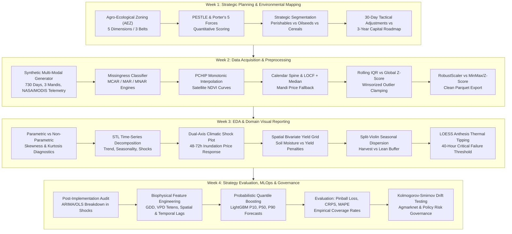

# Agribusiness Data Science & Strategy: Production-Grade Curriculum Repository

[](https://www.python.org/downloads/)
[](https://opensource.org/licenses/MIT)
[](https://peps.python.org/pep-0008/)
[]()

A production-grade, end-to-end practical repository for agricultural data science, commodity market analytics, and strategic procurement. 

This repository provides four self-contained, fully executable Jupyter Notebooks covering the entire spectrum of modern agricultural analytics: from macro agro-ecological zoning and competitive supply chain strategy, through biophysical telemetry data engineering and nonlinear shock visualization, to probabilistic quantile forecasting and MLOps governance under climate anomalies.

---

## Curriculum Roadmap



---

## Repository Structure

```
Junior-Data-Science-Analyst---Agribusiness/
├── README.md                                      # Project documentation & architecture
├── requirements.txt                              # Pinned Python package dependencies
├── pyproject.toml                                # Packaging configuration
├── .gitignore                                    # Telemetry, cache, and parquet ignores
├── data/                                         # Processed telemetry and reference data
│   ├── .gitkeep
│   └── clean_agritech_telemetry.parquet          # Cleaned multi-modal dataset (Week 2 output)
└── notebooks/
    ├── 01_week1_strategic_environmental_mapping.ipynb
    ├── 02_week2_acquisition_preprocessing.ipynb
    ├── 03_week3_eda_visualizations.ipynb
    └── 04_week4_strategy_evaluation_models.ipynb
```

---

## Detailed Weekly Specifications

### Week 1: Strategic Planning and Environmental Mapping (`01_week1_strategic_environmental_mapping.ipynb`)
- **Agro-Ecological Zoning (AEZ) Framework**:
  - Formalized quantification of 5 core biophysical dimensions across 3 major agricultural belts:
    1. *Soil pH* (Acidity/Alkalinity impact on nutrient uptake)
    2. *Soil Organic Carbon % (SOC)* (Microbial health and soil water retention)
    3. *Available Water Capacity (AWC in mm/m)* (Drought resilience and moisture buffering)
    4. *Mean Annual Precipitation (MAP in mm)* (Rainfed vs irrigated regime determination)
    5. *Thermal Heat Unit Window (Cumulative GDD in °C-days)* (Phenological maturation ceiling)
  - Regional focus: **Indo-Gangetic Plains** (Karnal, Haryana), **Malwa Plateau** (Ujjain, Madhya Pradesh), and **Deccan Semi-Arid** (Kolar, Karnataka).
- **PESTLE & Porter's 5 Forces Quantitative Scoring**:
  - Macro-environmental PESTLE evaluation covering minimum support prices (MSP), export restrictions, fertilizer subsidy rationalization, AgriStack DPI integration, and extreme weather volatility.
  - Porter's Five Forces model calibrated to agricultural supply chains: Smallholder fragmentation vs FPO bargaining leverage, corporate buyer consolidation (ITC, Adani, roller flour mills), post-harvest perishability pressure, and substitution threats.
- **Strategic Segmentation & Positioning Matrix**:
  - Produce segmentation across:
    - *High-perishability horticulture* (Tomatoes, Onions)
    - *Cash oilseeds* (Soybean, Mustard)
    - *Staple cereals* (Wheat, Paddy)
  - Addressable procurement valuation, supply volatility coefficients ($CV$), price elasticities ($E_d, E_s$), and strategic quadrant mapping (Core Volume Drivers, Margin Arbitrage Plays, High-Risk Volatile Assets).
- **Synthesized Strategic Roadmap**:
  - 30-day tactical operational adjustments (moisture-refraction discount matrices, gate arrival quotas, rapid QA sorting) versus 3-year capital investments (decentralized farmgate solar micro-cold stores, multi-district FPO forward contracts, IoT micrometeorological stations).

### Week 2: Data Acquisition & Preprocessing Execution (`02_week2_acquisition_preprocessing.ipynb`)
- **Multi-Modal Synthetic Telemetry Generator**:
  - 730 consecutive daily records (2 complete agricultural years: 2024–2025) across Karnal, Ujjain, and Kolar.
  - Realistic domain modeling:
    - `modal_price` (INR/Qtl): Log-normal seasonal trajectories reflecting Rabi/Kharif post-harvest glut collapse.
    - `arrivals_qtl`: Zero-inflated, heavy-tailed volume spikes during peak mandi harvest flushes.
    - `rainfall_mm`: Zero-inflated Gamma distribution with monsoon concentration and extreme cloudburst events (>100 mm).
    - `ndvi`: 16-day MODIS-style composite intervals with phenological bell curves, realistic vegetation ranges (0.20–0.82), and cloud contamination dropouts.
    - `soil_moisture_z`: Root-zone saturation index standardized against long-term climatological normals.
- **Missing Data Imputation Engine**:
  - Mechanistic taxonomy:
    - **MCAR**: Telemetry transmission dropouts (~3–5%).
    - **MAR**: Mandi weekly Sunday closures and statutory market holidays.
    - **MNAR**: Farmer delivery withholding during severe price crashes below production cost.
  - **PCHIP Interpolation** (`scipy.interpolate.PchipInterpolator`): Monotonic, shape-preserving cubic Hermite interpolation for satellite NDVI, eliminating non-physical overshoots seen in standard cubic splines.
  - **Calendar Spine & LOCF**: Seamless date spine alignment, bounded Last Observation Carried Forward (max 4 days) to prevent stale price carryover, and rolling 14-day median fallback.
- **Agricultural Anomaly Detection & Clamping**:
  - Comparison of Global Z-score ($Z > 3.5$) versus 30-day Rolling IQR filter:
    $$\text{Threshold}_{\text{upper}} = \text{Median}_{30} + 2.5 \times \text{IQR}_{30}$$
  - Distinguishing keystroke clerical errors (e.g., INR 54,000 vs 5,400) from genuine climatic shock spikes (e.g., unseasonal hailstorms destroying standing crops).
  - Two-sided 99th percentile Winsorization for variance stabilization.
- **Feature Normalization Layer**:
  - Comparison of Min-Max Scaling, Standard Z-score, and `RobustScaler` on fat-tailed agricultural distributions.
  - Export to high-performance Parquet format (`data/clean_agritech_telemetry.parquet`).

### Week 3: Exploratory Data Analysis & Visual Reporting (`03_week3_eda_visualizations.ipynb`)
- **Parametric vs. Non-Parametric Distributional Diagnostics**:
  - Computation of $\mu, \sigma$, Skewness, and Excess Kurtosis alongside Median, IQR, and Median Absolute Deviation (MAD).
  - Rigorous statistical demonstration of agricultural market non-normality and tail risk.
- **STL Time-Series Decomposition**:
  - Seasonal and Trend decomposition using Loess (`statsmodels.tsa.seasonal.STL`) on daily wholesale prices.
  - Extraction of Secular Trend ($T_t$), Kharif/Rabi Multiplicative Seasonality ($S_t$), and Stochastic Shock Innovations ($I_t$).
- **Four Production-Grade Visualizations**:
  1. *Dual-Axis Climatic Shock Plot*: Inverted precipitation bars against daily mandi arrivals (MT) and wholesale prices (INR/Qtl), highlighting the 48–72 hour post-flood supply contraction and price spike.
  2. *Spatial Bivariate Yield Divergence Grid*: 2D scatter and contour mapping of root-zone soil moisture anomalies against crop yield departures, illustrating asymmetric yield penalties for waterlogging vs drought.
  3. *Split-Violin Seasonal Dispersion Plot*: Multi-modal kernel density distributions across operational procurement windows: Peak Harvest, Mid-Season Storage Release, and Lean Buffer.
  4. *Non-Linear LOESS Thermal Tipping Curve*: Anthesis heat stress hours ($T_{\text{max}} \ge 35^\circ\text{C}$) mapped against Wheat Yield (Qtl/Ha), identifying the 40-hour critical failure threshold.
- **Executive Procurement Decision Frameworks**:
  - Dynamic freight rerouting matrix, cold storage arbitrage window triggers, and parametric weather-index insurance trigger schedules.

### Week 4: Strategy Evaluation, MLOps & Continuous Improvement (`04_week4_strategy_evaluation_models.ipynb`)
- **Post-Implementation Econometric Audit**:
  - Comparison of baseline ARIMA and Ordinary Least Squares against realized market outcomes during climate shock regimes, revealing structural model breakdowns.
- **Biophysical Feature Engineering Pipeline**:
  - Growing Degree Days (GDD):
    $$\text{GDD} = \max\left(0, \frac{T_{\text{max}} + T_{\text{min}}}{2} - T_{\text{base}}\right)$$
  - Vapor Pressure Deficit (VPD in kPa) using the Tetens formulation:
    $$e_s(T) = 0.61078 \exp\left(\frac{17.27 T}{T + 237.3}\right), \quad \text{VPD} = e_s(T) \times \left(1 - \frac{\text{RH}}{100}\right)$$
  - Spatial Lags (regional mandi spillover within a 100 km radius cluster) and backward temporal lags ($t-1, t-3, t-7, t-14, t-30$).
- **Probabilistic Quantile Machine Learning**:
  - Quantile Gradient Boosting (`LightGBM` / `HistGradientBoostingRegressor`) forecasting 14-day forward spot prices at quantiles:
    $$\alpha \in [0.10, 0.50, 0.90]$$
  - Model evaluation using Quantile Pinball Loss, Mean Absolute Percentage Error (MAPE), Continuous Ranked Probability Score (CRPS), and empirical coverage rates.
- **Model Drift Monitoring & Enterprise Governance Matrix**:
  - Two-sample Kolmogorov-Smirnov (KS) test (`scipy.stats.ks_2samp`) on rolling seasonal feature distributions with automated drift alert flags.
  - Enterprise Risk Mitigation Matrix covering Agmarknet/e-NAM API downtime, regulatory export bans/stock limits, and Human-in-the-Loop (HITL) procurement desk guardrails.

---

## Data Dictionary

| Variable Name | Unit / Type | Description | Source Analog |
| :--- | :--- | :--- | :--- |
| `date` | `YYYY-MM-DD` | Calendar record timestamp (daily continuous) | Calendar Spine |
| `district` | Categorical | Agro-climatic district (`Karnal`, `Ujjain`, `Kolar`) | Administrative Census |
| `state` | Categorical | State (`Haryana`, `Madhya Pradesh`, `Karnataka`) | Administrative Census |
| `commodity` | Categorical | Target crop (`Wheat`, `Soybean`, `Tomato`) | Mandi Gazette |
| `modal_price` | `INR / Quintal` | Most frequent wholesale transaction price in mandi | Agmarknet / e-NAM |
| `arrivals_qtl` | `Quintals (100 kg)` | Total daily volume delivered to the market yard | Mandi Market Committee |
| `rainfall_mm` | `mm / day` | 24-hour accumulated surface rainfall | NASA POWER / IMD |
| `t_max` | `°Celsius` | Daily maximum 2-meter air temperature | NASA POWER / ERA5 |
| `t_min` | `°Celsius` | Daily minimum 2-meter air temperature | NASA POWER / ERA5 |
| `rh_pct` | `Percentage (%)` | Daily mean surface relative humidity | NASA POWER |
| `ndvi` | `Float [-1, 1]` | Normalized Difference Vegetation Index (16-day composite) | MODIS MOD13Q1 / Sentinel-2 |
| `soil_moisture_z` | `Z-score [σ]` | Root-zone soil moisture anomaly relative to 20-yr normal | NASA SMAP / GRACE |
| `gdd` | `°C-days` | Growing Degree Days accumulated above $T_{\text{base}}$ | Derived Biophysical |
| `vpd_kpa` | `kPa` | Vapor Pressure Deficit derived via Tetens equation | Derived Biophysical |

---

## Quickstart & Environment Setup

### 1. Clone Repository & Setup Virtual Environment
```bash
git clone https://github.com/Anirban4ru/Junior-Data-Science-Analyst---Agribusiness.git
cd Junior-Data-Science-Analyst---Agribusiness

# Using Python venv
python -m venv .venv
source .venv/bin/activate  # On Linux/macOS
# .venv\Scripts\activate   # On Windows

# Or using uv (recommended for fast setup)
uv venv .venv --python 3.12
source .venv/bin/activate
```

### 2. Install Dependencies
```bash
pip install -r requirements.txt
# Or with uv:
uv pip install -r requirements.txt
```

### 3. Launch Jupyter Notebooks
```bash
jupyter lab notebooks/
# Or
jupyter notebook notebooks/
```

Execute the notebooks sequentially from Week 1 to Week 4. Each notebook is 100% self-contained and will run cleanly with zero external data dependencies.

---

## Production Execution & Code Standards
- All code cells adhere to PEP 8 standards with explicit type hints and descriptive docstrings.
- Visualizations use high-DPI configurations (`dpi=300`, curated hex palettes, sans-serif typography).
- Parquet outputs utilize Snappy compression for minimal disk footprint and fast columnar reads.

